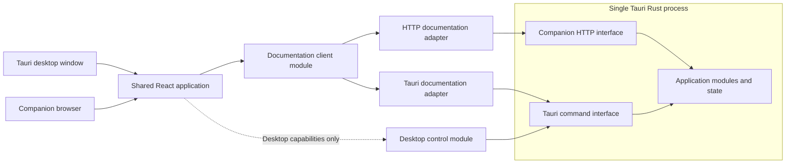

# Technical design

Status: In progress

Last updated: 2026-07-26

This document turns the accepted product requirements into an implementable design. It records decisions as they are made; undecided areas remain explicit rather than being filled with speculative structure.

## Scope

This pass will define:

- Runtime and process responsibilities.
- Rust module ownership and interfaces.
- The parsed, resolved, and documented data shapes.
- Persistence and cache structure.
- The local HTTP interface.
- Desktop-only Tauri controls.
- Companion authorization and access enforcement.
- Frontend module seams and routing.
- Verification seams.

It will not produce an implementation sequence or issue breakdown. Those belong in the implementation plan written after this design is accepted.

## Persistence principle

**Derive what you can; store what you must.**

This applies the repository's [engineering principles](../AGENTS.md): persisted state represents user intent, an atomic publication decision, or an expensive immutable artifact with a validated identity. Filesystem inventory, availability, compatibility status, cache freshness, and other facts that can be reconstructed from Discovery Locations, Mod Source, revision manifests, and current analysis versions remain derived.

The application does not maintain a mutable duplicate of the Mod Library. On startup it scans lightweight metadata in Discovery Locations and reconstructs the current catalog without parsing or fingerprinting complete Mod Source. Persisted revision references and preferences may be reconciled with the derived installations, but they do not make a missing installation appear currently installed.

### Durable mutable state

The minimum durable mutable state is:

- Discovery Locations, including user corrections.
- User-owned preferences such as an explicit language override, last Target Mod, search filters, and Hidden Routes.
- The atomically published Documentation Revision reference associated with each known Mod Installation.
- The schema version required to interpret that state.

Current Mod Library contents, compatibility and dependency warnings, and cache freshness are derived. Companion Sessions and active build state belong to the running process and are not persisted. Search indexes belong to immutable revision bundles or disposable memory caches.

Filesystem metadata snapshots may be stored to accelerate fingerprint calculation, but they are disposable hints. They cannot establish cache identity or freshness without the authoritative content-fingerprint rules.

### Mutable state storage

The durable mutable state is stored in one versioned JSON document under the application data location. A deep state module owns:

- The persisted schema and application-owned parsed state type.
- Initial loading and schema dispatch.
- In-process mutation serialization.
- Encoding and crash-safe replacement.
- Errors and recovery information exposed to application use cases.

The composition root resolves the platform-specific application data location and supplies it to the state module. React, Tauri commands, Companion HTTP handlers, and other application modules do not address the state file directly.

The running process holds one authoritative in-memory state value. A mutation produces a complete next value, encodes it to a temporary file beside the current state file, flushes the new contents, atomically replaces the prior path, and synchronizes the containing directory where the platform provides a meaningful durability operation.

Mutations are serialized, and their normative commit point is successful atomic replacement of the state path. Failures before replacement leave the prior state authoritative. A failure after replacement may mean the new state is visible but its durability is uncertain; it is a distinct `CommittedDurabilityUncertain` internal outcome rather than a claim that the old file survived.

After any ambiguous replacement outcome, the state module reopens and validates the authoritative path. If it contains the complete next state, memory advances to that state and the application reports that durability could not be confirmed. If it contains the prior state, memory remains on the prior state. If neither valid state can be established, normal mutation and publication stop and state recovery begins. Callers never infer the committed value from the filesystem error alone.

The state module exposes a narrow publication-reference mutation to `revisions`. It accepts a Mod Installation identifier, the expected prior reference when applicable, and the validated replacement revision identity. It does not expose the mutable JSON document or permit `revisions` to alter unrelated user settings.

Disposable filesystem metadata used to accelerate fingerprinting is stored separately and may be deleted or rebuilt without affecting user intent or published-revision references. Revision bundles likewise remain separate immutable artifacts.

### State evolution and recovery

An absent state file begins normal first-launch setup. A supported older schema is migrated in memory, parsed into the current application-owned state type, and then persisted through the normal atomic replacement path.

Malformed JSON, an invalid current-schema value, or a failed older-schema migration does not overwrite the unreadable file in place. The state module first moves it to a diagnostic quarantine name containing a timestamp and content hash, then persists defaults through the normal replacement protocol. The app shows a visible notice that settings were reset and that publication-reference recovery remains unresolved.

While publication-reference recovery is unresolved, orphan revision cleanup and Asset Store garbage collection are disabled for that startup. The recovery notice offers two explicit exits: restore or repair the quarantined state and restart, or confirm that unrecovered publication references may be discarded. This is a focused recovery flow rather than a general backup-management or field-level repair system.

A state file declaring a newer unsupported schema is different from malformed state: it may be valid data owned by a newer application version. The app does not overwrite it or substitute mutable in-memory defaults. Startup stops at a blocking compatibility screen that explains the mismatch; normal application use cases, builds, Companion Mode, and state mutations do not start. The user may quit or install a compatible application version without risking a write to the newer file.

Every revision manifest records its Mod Installation identifier so a restored publication reference can be checked against the intended installation. Garbage collection always fails conservatively: if any retained revision manifest cannot be read and validated, the live revision and asset sets are incomplete and no orphan deletion proceeds.

### Installation identity

Each user-confirmed Discovery Location receives a stable stored identifier. Its absolute path is editable configuration rather than identity.

Filesystem discovery derives each Mod Installation identifier from:

```text
Discovery Location identifier + normalized relative mod path
```

The derivation is deterministic within the app's identifier scheme and yields an opaque identifier for use by preferences, revision publication references, and transport responses. Absolute paths, titles, declared versions, Workshop identities, and content fingerprints are not embedded in the public identifier.

Changing Mod Source at the same relative path preserves Mod Installation identity and changes its content fingerprint. Editing the absolute path of an existing Discovery Location preserves derived installation identities when relative paths remain the same. Moving a mod within a location creates a new identity. The same content discovered through two Discovery Locations remains two Mod Installations.

Logical relative paths use `/` separators, Unicode NFC, exact case-preserving comparison, and no `.` or `..` components. Sorting compares the normalized UTF-8 bytes. Windows drive letters and root prefixes never enter a relative identity. Invalid Unicode is rejected without lossy conversion, and two raw entries that normalize to the same logical path produce a visible collision rather than an arbitrary winner. A case-only rename therefore changes the fingerprint on every platform.

Symlinks, junctions, and other reparse points are resolved for containment and cycle checks but retain their lexical root-relative path as logical identity. Targets outside the canonical Discovery Location, traversal escapes, and cycles are rejected. Following a directory indirection may expose the same physical file under multiple valid logical paths; those paths remain separate inputs because Stellaris addresses their logical locations.

Editing a Discovery Location path is explicitly a rebind of the same configured location. Its confirmation explains that per-installation preferences remain attached by relative path and existing revisions will be revalidated against the new source. Choosing a genuinely different library instead requires removing the old Discovery Location and adding a new one, which creates a new location identity and does not inherit its preferences.

## System context



Both runtime contexts use the same React pages and documentation-client interface. Runtime bootstrap selects the Tauri documentation adapter in the desktop window and the HTTP documentation adapter on a Companion Device. The desktop context additionally supplies privileged controls that do not exist on a Companion Device.

## Runtime topology

The Tauri Rust process owns:

- Application startup and shutdown.
- Configuration and discovered Mod Installations.
- Parsing, resolution, documentation generation, and asset conversion.
- Generated-documentation and asset caches.
- The Companion HTTP listener while Companion Mode is enabled.
- Companion Sessions.

The current Mod Library is derived from Discovery Locations. Discovery reports the filesystem state observed by the current scan; it does not read a persisted catalog and then attempt to synchronize it.

The MVP does not use a sidecar or child process. A separate process would introduce another lifecycle, packaging path, failure mode, and inter-process protocol without a current requirement for independent deployment or crash isolation.

The host's application modules are the authority for behavior and state. Local HTTP handlers and Tauri commands are input adapters that call those modules; they do not implement parallel rules and do not call through one another.

Parsing, hashing, generation, and conversion are CPU or filesystem work and must not run on the UI thread or occupy asynchronous I/O workers for their duration. The host runs that work through bounded background execution.

Whether a build is an awaited asynchronous Tauri command or an explicit host-owned job is deferred until representative end-to-end build timings are available. Both implementations use private staging state and the same atomic publication operation. An explicit job model is justified only if builds are long enough to need reconnectable status, meaningful progress, navigation-independent execution, or user cancellation. Neither completed dependency spike decides this: Vanilla Content and one representative large mod parse in roughly 100 ms through the parallel parser-spike adapter, while the DDS spike deliberately captured correctness and determinism rather than throughput. The choice remains based on the complete production build, including resolution, documentation generation, indexing, and conversion of the assets actually referenced by that revision.

The Tauri process owns the complete lifecycle. Startup constructs shared host state before Tauri commands accept requests. Enabling Companion Mode starts the LAN HTTP listener only after that state is ready; disabling it stops the listener and invalidates Companion Sessions. Shutdown rejects new work, stops any active listener, safely terminates or drains active build work without publishing incomplete staging state, and then releases cache and configuration resources.

### Single-instance ownership

The packaged application permits one Desktop Host process per fixed application identifier. Its packaged configuration maps that identifier to one application-data directory, so that process is the sole packaged owner of the directory's in-memory mutable state, JSON replacement, builds, revision publication, retention cleanup, Companion listener, pairing secrets, and Companion Sessions.

A second normal launch activates or restores the existing desktop window and exits without constructing another host. Multiple current or future windows and tabs remain views within that one process and do not require additional state owners.

The packaged desktop app implements this behavior with Tauri's official `tauri-plugin-single-instance`, registered before every other Tauri plugin as required. Its callback shows, restores, and focuses the existing main window. The MVP does not interpret second-launch arguments or construct another application host.

On Windows and Linux, the plugin's mutex or DBus ownership is released with the owning process. On macOS, the current plugin instead uses an application-identifier-derived Unix socket under `/tmp`. A new launch connect-tests that socket and removes it after a not-found or connection-refused result, so a stale socket self-heals rather than permanently locking out the app.

Because the macOS socket location is shared across users, simultaneous launches of the same application identifier in separate macOS user sessions may collide. The MVP accepts that upstream limitation, records it in release notes if it remains present in the pinned plugin version, and covers ordinary stale-socket recovery in its packaged macOS smoke test. If Snap or Flatpak packaging is added later, that package must declare and verify the plugin's required DBus ownership and communication permissions before inheriting the single-instance release claim.

The plugin does not inspect or lock an arbitrary data path. Differently identified binaries or custom development roots can collide if pointed at the same directory, so development tools and automated tests must use explicitly separate temporary application-data directories and either omit the packaged plugin or use isolated application identifiers. This isolation is a caller precondition, not a guarantee supplied by `tauri-plugin-single-instance`.

### Rust package and dependency direction

The MVP remains one Cargo package and one Rust process. The existing library target contains the application, transports, and composition; the executable target only starts it. Additional workspace crates are not introduced without a real independent consumer or an enforceable dependency problem that modules cannot contain.

The package is organized around this dependency direction:

```text
Tauri and HTTP adapters
        ↓
Application use cases and state
        ↓
Discovery, source, analysis, localization, revisions, search, and assets
        ↓
Filesystem, parser, image-decoder, and persistence adapters
```

Framework-specific request, response, window, and server types remain in the transport implementations. Application modules accept and return application-owned types and do not import Tauri or the HTTP framework. Parser-library and image-library types likewise remain inside their adapters.

The composition root constructs implementations and shared state once, then supplies them to both transports. A module earns a separate Interface when there are multiple implementations, a test substitute is necessary, or the implementation is an external-system adapter; the design does not create one Interface per module by default.

The diagram's lower row groups deep modules but does not imply that they are mutually independent. The permitted direct edges below `application` are:

- `analysis -> localization` for ingestion, resolution, and display-independent projections.
- `analysis -> search` for deterministic index construction.
- `assets -> source` for reads through the build's Source Snapshot capability.
- `revisions -> state` through the narrow publication-reference capability.
- `companion -> revisions` for authorized revision opening.

`companion` also consumes freshness observations produced by application workflows after `source` verification; it does not call source hashing for each read. Any additional deep-module edge requires an explicit owner and a cycle check rather than being introduced as a convenience dependency.

The accepted top-level module map is:

```text
composition
├── transport
│   ├── tauri
│   └── http
├── application
├── discovery
├── source
├── analysis
├── localization
├── search
├── revisions
├── assets
├── state
└── companion
```

`composition` constructs the concrete modules, process-lifetime shared state, background execution resources, and Tauri application. `transport` adapts Tauri commands and Companion HTTP requests into shared application DTOs and failure semantics.

`application` owns named product use cases and coordination that genuinely spans deep modules, including documentation reads and the Ensure, Rebuild, and Validate workflows. It does not contain generic repository abstractions, parser or resolver rules, persistence formats, transport behavior, or parallel implementations of module-owned policy.

`companion` owns pairing secrets, Companion Sessions, listener lifecycle and advertised addresses, current Companion-Ready access policy, and construction of trusted companion revision handles. Desktop access constructs its distinct revision handle through application-owned policy.

`discovery`, `source`, `analysis`, `localization`, `search`, `revisions`, `assets`, and `state` retain the responsibilities defined in their respective sections. Within `analysis`, parser adaptation, content-type-specific resolution, documentation generation, and Source Excerpt capture remain internal submodules rather than top-level application services.

### Source module

`source` is the sole owner of complete Mod Source traversal and content identity. It receives a discovered installation root and owns:

- Deterministic enumeration of analysis-relevant files.
- Logical path normalization and escape rejection.
- Reading and hashing the exact bytes presented for analysis.
- Target Mod and Vanilla Content fingerprints.
- Build-lifetime Source Snapshots.
- Final live-source verification before publication.
- Disposable filesystem metadata accelerators.

`discovery` remains lightweight: it finds Stellaris and Mod Installations and reads only the metadata needed to populate the Mod Library. It does not become a second fingerprint implementation or parse complete content.

A Source Snapshot exposes normalized logical paths, exact source bytes or a stable read capability, source-kind and provenance information, and the fingerprint derived from that content. Large binary assets may be captured lazily: their first successful snapshot read freezes the exact bytes and records the source provenance plus normalized logical path, later reads return those same bytes, and final verification compares the live file with that captured identity. Its physical representation may use memory, private temporary storage, or another build-lifetime implementation after measurement; consumers do not depend on that choice.

`analysis` accepts Source Snapshots rather than absolute installation paths or arbitrary filesystem access. End-to-end analysis tests construct snapshots from small fixture corpora using source-owned test support, so they exercise parsing through documentation generation without requiring a Steam installation, host-specific paths, filesystem timestamps, or live directory traversal.

The source module receives separate behavioral tests for edits, additions, deletions, renames, normalized ordering, path rejection, and changes during a build. Analysis fixtures preserve realistic logical paths and bytes so provenance and Source Excerpt behavior remain covered rather than being bypassed by pre-parsed test data.

### Analysis module

`analysis` is the deep module that turns exact Target Mod and Vanilla Content Source Snapshots plus typed asset-materialization outcomes into a finalized Revision Candidate:

```text
Source Snapshots
    -> analysis::analyze
    -> Analysis Draft
    -> assets::materialize
    -> Asset Materialization Outcomes
    -> analysis::finalize
    -> Revision Candidate
```

Parsing, adaptation into the application-owned parsed representation, content-type-specific resolution, documentation generation, search indexing, Source Excerpt capture, initial Analysis Issue accumulation, and determination of logical asset slots produce an Analysis Draft. The draft is not publishable and exposes only the typed asset requests needed by the application coordinator.

The `assets` module returns exactly one typed outcome for each requested slot: a materialized immutable key plus trusted blob metadata, or a typed missing-byte, malformed-media, unsupported-format, or conversion-failure result. Missing bytes are decided while reading the Source Snapshot; malformed media and unsupported input are classified before decoding; a conversion failure means a supported input failed during decode, encode, or publication staging. The module does not choose user-facing placeholders or mutate documentation.

`analysis::finalize` consumes the complete draft and outcome set. It deterministically substitutes placeholders for failed slots, adds revision, entry, section, or fact-scoped Analysis Issues, computes the final required-key set, and only then yields a Revision Candidate. A missing, duplicate, or unknown slot outcome is an internal contract failure and yields no candidate. This keeps documentation and completeness semantics inside `analysis` while `assets` retains byte-conversion mechanics.

Parser-library values, the application-owned parsed representation, resolved registries, the Analysis Draft, and asset outcome types do not escape into transports, revision readers, or React.

Internal `parser`, `resolver`, `documentation`, and excerpt-related modules retain direct domain tests. The parser adapter has an internal substitution seam because Jomini is an external dependency. The corpus spike is complete and Jomini is accepted, consumed through its `TokenReader` incremental lexer rather than its `TextTape`: the tape's `TextToken` API exposes no structural-token byte ranges, rejects real vanilla and mod syntax, and silently reparents a file whose braces do not balance, while the lexer supplies a byte position for every token and can be resumed after a fault. The production adapter must derive and verify a source range for every node, resynchronize past a syntax fault, and lex the Stellaris dialect constructs Jomini does not recognize. This seam does not turn every analysis stage into a public service or require application-layer orchestration.

The parser's private interface accepts one logical source identity plus exact bytes and returns an application-owned `ParsedFile`. It preserves ordered definitions and nodes with exact byte ranges and an evidence quality of Clean or Recovered, plus parse faults with their byte positions and recovery boundaries. Parser-library types, absolute paths, and raw recovery implementation details do not cross the seam.

Recovery is a heuristic about source layout, not a rule of the grammar. Any definition the parser cannot emit at a fault is absent, definitions proven before the first fault remain Clean, and definitions emitted after heuristic resynchronization are Recovered because their nesting may have been misattributed. `analysis` creates a visible file-scoped recovery issue, but completeness impact propagates only from absent or Recovered evidence; the diagnostic scope does not make earlier Clean facts incomplete. A stray token that leaves source syntactically valid is not detectable by either measured adapter and remains a disclosed limitation. The [parser evaluation](./spikes/parser-evaluation.md) holds the measurements, the captured records, and the residual limitations.

Source ranges may be much larger than a useful technical excerpt. Each captured Source Excerpt contains at most 16 KiB of original source bytes, aligned to line boundaries where possible and anchored around the referenced fact. Its display projection represents undecodable bytes visibly rather than dropping them, and leading or trailing omission is shown explicitly. Provenance retains the complete source range, but neither desktop nor companion excerpt reads can expand the reference into an arbitrary full-file read.

Search indexing remains an internal stage from the application layer's perspective, but `analysis` delegates its implementation to the shared deep `search` module described below. This preserves one owner for the index contract and ranking semantics used during both build and read.

The Revision Candidate contains the canonical generated read model, completeness information, captured excerpts, provenance, source fingerprints, analysis-component versions, final logical asset references, and required Asset Store keys needed for publication. Before publication, `application` asks `assets` to validate the exact required set by content hash or atomically recorded trusted blob metadata. Path existence alone is insufficient. The resulting sealed validation proof and candidate must name identical keys when passed to `revisions`.

Expected source problems become Analysis Issues in a completed candidate when partial generation remains possible. A fatal inability to establish the candidate's identity or structural integrity prevents candidate production rather than leaking a partially staged revision through the module boundary.

### Resolver contract and game oracle

The MVP resolver implements a two-contributor scope: one Vanilla Content Source Snapshot containing the base-game file set and one Target Mod Source Snapshot. DLC archives do not contribute script, localization, interface, or map definitions. DLC-gated definitions already live in Vanilla Content; `host_has_dlc` is analyzed as a requirement rather than as source selection or precedence. Whether DLC archives supply referenced visual assets is unexercised at the pinned build: the [DDS evaluation](./spikes/dds-evaluation.md) opened all 30 archives under `dlc/` and found only audio, `.asset`, and `.txt` entries, and no image of any format. The asset module therefore reads textures from the installation tree, and a future build that ships images inside an archive would be a new source-selection question rather than a covered one.

Two contributors do not imply two ordered layers. After applying exact-path shadowing and Target Mod `replace_path` declarations, a versioned Resolution Profile constructs the semantic file stream separately for each content family. Script registries and sprite definitions use one global normalized logical-path order across surviving Vanilla and Target Mod files. Localization uses its own ordered stream: surviving Vanilla files, ordinary mod files in enabled-mod order, then `replace/` files, with its content-specific collision rule. Inline scripts are path-addressed textual expansion rather than registry entries. The resolver refuses to substitute source origin, a generic merge, or a universal first- or last-wins rule for a missing policy.

Each registry policy must define:

- Its definition key and the unit at which files or directories shadow.
- Its content-family file stream after common file selection.
- Duplicate-definition behavior within one semantic stream.
- Cross-source collision behavior, without assuming source precedence.
- Whole-definition replacement, field inheritance, defaults, or another field rule.
- Ordering semantics for repeated definitions and values.
- Unresolved-reference behavior.
- Provenance for every contributed, inherited, defaulted, duplicate, and shadowed fact.

The required matrix is maintained in the [resolver evaluation](./spikes/resolver-evaluation.md). Its pre-implementation evidence phase is complete: every question reachable through filesystem inspection and the current game-oracle harness has been investigated. The resulting Resolution Profile is intentionally partial until the resolver exists. A content type may be claimed as supported only when every policy it requires is explicit and oracle-backed; an unresolved cell fails visibly instead of becoming implementation discretion or blocking work on unrelated resolved rows.

The game oracle is a reproducible fixture protocol rather than an informal manual observation. Each oracle record pins:

- Stellaris build identifier and executable checksum.
- Operating system and architecture.
- Installed DLC availability needed to interpret gated requirements; there is no DLC definition-source ordering.
- Complete fixture source, normalized file checksums, and launcher configuration.
- The exact observation mechanism, including console commands, scripted effects, logs, UI facts, or extracted game state.
- Expected effective definitions field by field and their expected provenance.
- The responsible policy row and analysis-version change required when behavior changes.

Oracle evidence is re-run whenever the supported Stellaris build changes. A changed result blocks the version update until the Resolution Profile and golden expectations are intentionally revised. The omitted-`potential` technology redefinition is the first mandatory oracle case.

### Canonicalization and numeric representation

Every value used by a fingerprint, content hash, Revision identifier, Entry Key component, Hidden Route identity, manifest, or reproducibility assertion uses one versioned canonical encoding owned by the relevant deep module rather than default map iteration or serializer behavior.

The shared canonical rules are:

- Logical paths use the normalization and byte ordering defined under Installation identity. Absolute roots never participate.
- Each Source Snapshot inventories its own files by normalized logical-path bytes. Parsed definitions retain their ordinal within each file. This stable inventory order supports fingerprints and reproducible parsing but does not assign game precedence.
- After common exact-path and `replace_path` selection, the Resolution Profile constructs the semantic file stream for each content family. Script and sprite streams use normalized logical path plus definition ordinal across both contributors; localization and any future exceptional family use their explicitly versioned order. Source origin never substitutes for semantic stream position.
- Resolved registries sort by explicit content-category rank and Entry Key for canonical publication. Provenance records actual semantic resolution order, source identity, logical path, and definition ordinal; presentation may group it by origin without changing identity.
- Maps encode keys in canonical UTF-8 byte order. Sets encode members by their canonical structural bytes.
- Source-ordered sequences remain ordered when game semantics can depend on order. Types whose semantics are explicitly commutative, including supported `all` and `any` requirement groups, sort children by canonical structural digest. Unknown sequences are never reordered speculatively.
- Requirements, modifiers, Unlock Effects, routes, Analysis Issues, and Source Excerpts each define a total order in their owning schema. Analysis Issues order by scope, Entry Key, source identity, range, and issue code; presentation may group them without changing canonical identity.
- Search normalization uses a pinned Unicode-data version, Unicode NFKC, default locale-independent case folding, and canonical whitespace collapse. Language-specific display collation never feeds identity or ranking ties.
- JSON object member order is not authoritative. Bundle hashes use the canonical application encoding and required-entry content hashes, not incidental pretty-printed JSON bytes.

A Revision identifier is the SHA-256 digest of a domain separator plus the canonical manifest body excluding the identifier itself. That body includes the Mod Installation identifier, input fingerprints, referenced source-asset inputs, the full analysis version vector, schema versions, required-entry hashes, required localization-chunk keys when used, and required Asset Store keys. Temporary roots, timestamps, worker schedules, and final bundle paths are excluded.

The analysis version vector formally includes source-enumeration policy, parsed-model schema, Resolution Profile, documentation schema and generator, localization interpretation, search normalization and index schema, canonical encoding, Hidden Route identity, Analysis Issue propagation, and every asset conversion recipe. Any semantic change to one component changes its version.

Numeric source values use an application-owned representation that preserves the original lexeme and, when supported, an exact normalized value. Integers and finite base-10 decimals normalize to an arbitrary-precision rational coefficient and denominator; deterministic static addition, subtraction, multiplication, and division operate on that exact form. Binary floating point never participates in source equality, hashes, stable identity, or displayed exact Base Values. Operations whose Stellaris rounding or runtime numeric semantics have not been proven remain symbolic or visibly unresolved rather than being approximated.

### Analysis Issue impact

Generated facts retain evidence dependencies from source nodes through resolved definitions and documentation sections. Analysis Issues attach to the narrowest known evidence node and carry both an issue kind and impact kind:

- **Evidence absent** — a required file, definition, reference, or asset could not be read or found.
- **Evidence present but unsupported** — source was retained, but one construct could not be interpreted.
- **Registry completeness unknown** — a failed registry file means the complete entry set for that registry cannot be established.
- **Derived fact potentially incomplete** — an explicit dependency consumed affected evidence.

Impact propagation follows recorded dependency edges only. A localization failure affects the keys and language-dependent names, descriptions, and search material that consumed it, not unrelated mechanical weight facts. An unparsed scripted trigger marks the requirement sections of its known consumers and their dependent Route Summaries, not every entry. A failed technology registry file marks category enumeration incomplete even though successfully parsed entries may retain complete supported facts. An unsupported modifier condition remains visibly present as unsupported and marks that modifier's interpretation incomplete; it is never silently dropped.

Revision-level completeness is the union of registry-wide and otherwise unscoped impacts. Entry and section warnings are derived from their evidence dependency closure. The Revision Candidate retains typed unsupported or unresolved facts, not merely a list of warning strings, so transports and React cannot accidentally present missing evidence as a known empty value.

### Localization module

`localization` is the deep module that owns the Stellaris localization language and its reusable interpretations:

- Localization-file ingestion and locale identity.
- Markup tokenization.
- Selected-language, English, then raw-key fallback.
- Static Localization Reference resolution and cycle detection.
- Preservation of Runtime Localization Tokens and unknown markup.
- Plain-text projection for search indexing.
- Application-owned display tokens for controlled frontend rendering.

Analysis invokes localization ingestion and tokenization as internal build stages and preserves every available language plus the parsed localization structure in the Revision Candidate. Search index construction uses the localization module's plain-text projection rather than implementing another markup stripper or fallback chain.

The revision-bundle spike measures how much this all-language preservation duplicates across revisions. If that duplication is material, the pre-authorized response is an immutable content-addressed Localization Store outside individual bundles. Revision manifests would list required localization-chunk keys, the Revision Reader would validate membership before loading them, and cleanup would derive liveness from retained manifests. This changes physical storage only; selection, fallback, tokenization, and the localization module's semantic authority remain unchanged.

At read time, the Revision Reader supplies preserved localization data to the localization module. An entry request selects a language and receives safe display tokens for text, supported style or color, inline asset references, and visibly raw unsupported constructs. React maps those tokens to controlled components and CSS; it does not parse Stellaris localization strings or recursively resolve references.

Changing the selected language causes document and search reads against the same immutable revision. It does not reparse Mod Source or rebuild Player Documentation.

Desktop language selection is persisted user configuration. A new Companion Session begins with that desktop-selected language so documentation initially matches the terminology used by the player's game.

The companion may select another available language in browser memory for its current session. Search and entry requests carry this effective language, but the override does not mutate host configuration or use browser local storage. Reloading the companion or beginning another Companion Session returns to the current desktop selection.

The effective desktop language is derived in this order:

```text
explicit app override
    -> currently detected Stellaris language
    -> English
```

Only the explicit override is durable app state. The detected Stellaris language is refreshed from current game configuration during startup and explicit Refresh rather than copied into the mutable-state authority. Without an override, a later game-language change therefore changes the effective documentation language automatically.

On macOS, access to Stellaris configuration under the user's Documents folder may be denied by the operating system. That condition is not treated as an empty or missing language value: the desktop shows a non-blocking access notice, falls back to English, and continues to offer an explicit language override.

If the effective language is absent from one revision or localization key, the localization module still applies the independent selected-language, English, then raw-key fallback.

### Documentation build use cases

The desktop application exposes intention-revealing workflows rather than one command per internal analysis stage:

- **Ensure Documentation** reuses a current valid published revision and otherwise runs the complete build and publication workflow.
- **Rebuild Documentation** deliberately bypasses a valid-revision cache hit, reruns the complete analysis, and atomically publishes the result.
- **Validate Published Revision** performs read-only integrity diagnostics against the current bundle.
- A future debug-only recovery use case may validate and republish an existing complete bundle that the host has already discovered.

Ensure and Rebuild share one private coordinator with an explicit cache policy. Both derive source identity, establish the build input snapshot, produce an Analysis Draft, materialize its asset requests, finalize the Revision Candidate through `analysis`, obtain a content-valid Asset Store proof, and publish only through `revisions`. Rebuild bypasses reuse; it does not bypass fingerprints, finalization, structural validation, staging, or atomic publication.

An Ensure cache hit skips analysis, conversion, bundle writing, and publication only after authoritative freshness verification succeeds. It may still spend seconds enumerating and hashing a large Vanilla or mod corpus, especially on slower storage. The desktop presents this phase as “Checking for changes…” so a correct cache hit is not described as instantaneous or mistaken for a stalled rebuild.

The application does not expose independently sequenced Parse, Resolve, Generate, or unchecked Publish commands. Purpose-built desktop diagnostics may inspect a stage through an internal test or debug seam, but they do not require the frontend to understand pipeline ordering or construct a publishable candidate.

Companion Devices receive none of these capabilities. Whether Ensure and Rebuild are awaited Tauri commands or start a host-owned job remains governed by the deferred build-duration decision.

### Build concurrency

The MVP permits one active mutating documentation build across the process. Ensure Documentation and Rebuild Documentation must acquire one host-owned build lease before establishing a Source Snapshot. The lease remains held through draft analysis, asset materialization, candidate finalization, asset validation, publication or failure cleanup, and is always released when the workflow ends.

A concurrent Ensure or Rebuild request returns the operation-specific expected `BuildInProgress` result with the active Mod Installation identifier. It does not join the existing work, enqueue a hidden follow-up build, cancel it, or start competing source and asset work.

Published documentation reads and Validate Published Revision remain available during a build because they operate through immutable pinned revision handles. Internal work within the one build may still use bounded parallel execution for parsing, hashing, indexing, or asset conversion.

A persistent queue, Build all action, or multiple simultaneous Mod Installation builds requires measured demand and a new resource and UI policy. The single-build rule is independent of whether the invocation is an awaited command or a host-owned job.

### Source snapshot consistency

The source module implements an optimistic snapshot protocol rather than allowing analysis to parse from an unverified sequence of live filesystem reads:

1. Enumerate the complete set of analysis-relevant non-asset files in deterministic normalized-path order.
2. Read each file into a bounded buffer, hash and parse the same bytes, and capture required Source Excerpts from those bytes.
3. Produce the Analysis Draft and its asset requests from those exact bytes.
4. Resolve requested source assets through the same Source Snapshot capability, freeze and hash their exact bytes, and record their source provenance plus normalized logical paths in materialization outcomes.
5. Finalize the Revision Candidate and its input fingerprint from that complete logical snapshot.
6. Recompute the authoritative live-source fingerprint, including every referenced source asset, immediately before publication.
7. Publish only when the current paths and contents still match the candidate's snapshot.

A mismatch means the source changed during analysis. The candidate is discarded without changing the published revision, and the desktop receives an expected build outcome. Automatic retry behavior may be chosen with the build invocation model, but no retry may publish a candidate whose input check failed.

The correctness-first implementation may read and hash source content twice. Filesystem timestamps and cached metadata may avoid unnecessary work only when the authoritative fingerprint protocol still proves the same content identity.

Each revision manifest retains a sorted referenced-source-asset input set containing source provenance, normalized logical path, and source-byte hash, in addition to the derived Asset Store key. Ensure Documentation re-hashes that prior set when checking an existing revision. An asset edit, deletion, or replacement therefore invalidates the revision even when no script changed. A script or UI-definition edit already invalidates the non-asset fingerprint and lets the next analysis discover a different reference set.

Referenced source assets participate in both freshness identity and final required-key validation. The build does not hash unrelated large binary assets merely because they are present in the same mod.

A preliminary local measurement of broad script, localization, and UI-definition corpora found second-pass SHA-256 costs of approximately 0.13s for Acquisition of Technology, 0.23s for ACOT, 0.52s for Gigastructures, and 1.78s for Vanilla. These directional measurements support the correctness-first design; the integrated revision-bundle spike remains authoritative for final performance decisions.

## Documentation revision publication

A Target Mod build produces an immutable Documentation Revision tied to its exact source fingerprints and complete analysis version vector. A completed build may publish Incomplete Documentation when it contains disclosed Analysis Issues; incompleteness is a property of the revision, not evidence of a half-published build.

Parsing, resolution, generation, indexing, Source Excerpt capture, and required asset conversion write to build-owned staging state that documentation readers cannot address. The host validates the staged manifest and required cache entries before publishing the revision with one atomic pointer change.

Reads that begin before publication continue against the previous revision. Reads that begin afterward use the new revision. A failed or cancelled build never changes the published pointer, and its staging state is eligible for cleanup.

When current fingerprints no longer match a published revision, the desktop may continue reading that revision with a prominent stale state while a replacement is built. It is no longer a Companion-Ready Cache and cannot be opened from a Companion Device. Retention and garbage collection of superseded revisions remain a persistence-design decision.

### Durable revision contents

A Documentation Revision persists the generated read model required by the desktop and companion experiences:

- Player Documentation records and their causal traces.
- Search indexes and category metadata.
- Preserved localizations and the data required for fallback behavior.
- Analysis Issues, completeness state, provenance, and source ranges.
- Bounded Source Excerpts captured from the analyzed source.
- References to the browser-safe assets required by the revision.
- Referenced source-asset identities and byte hashes required to revalidate asset freshness.

React-specific view state and renderer-library types are not revision data.

### Disposable build data

The parser adapter converts parser-library output immediately into an application-owned parsed representation. Resolution and documentation generation consume that representation without exposing parser-library types through the rest of the host.

Parser output, the application-owned parsed representation, the resolved content model, the Analysis Draft, and typed asset-materialization outcomes are build artifacts rather than required parts of a published Documentation Revision. Normal documentation reads do not load them. Removing these artifacts may make the next build slower but must not lose configuration, user preferences, or a published revision.

A separately versioned parsed Vanilla Content cache is permitted because the same input is reused across Target Mods. It is a disposable performance cache, not part of a Documentation Revision or a second source of truth. Target Mod intermediate caching remains deferred until profiling demonstrates that rebuilding from source is too expensive.

### Revision bundles

Each Documentation Revision is stored as one immutable directory under an application-owned revisions location. The bundle contains:

- A manifest identifying the revision, Mod Installation identifier, exact input fingerprints, complete analysis version vector, schema versions, completeness state, and required entries.
- The structured documentation and search data.
- Captured Source Excerpts.
- Logical asset references, the referenced source-asset input set, and the complete set of required Asset Store keys.

A build writes a new bundle in an adjacent staging location on the same filesystem as the revisions location. After validating the manifest, every required entry, and a content-valid Asset Store proof for the exact required-key set, the host moves it to its canonical immutable revision path and atomically changes the application-state pointer for that Mod Installation.

`revisions` owns this complete publication protocol. Application use cases supply the validated Revision Candidate and do not separately move the bundle or mutate state. The module finalizes the bundle, then invokes the narrow state publication-reference capability.

Bundle completion and revision publication have separate commit points. The bundle becomes a complete immutable artifact after its validated staging directory is durably moved to the final path; it is not visible documentation until the state publication-reference replacement commits. A crash before that pointer commit can leave an unreferenced complete bundle while readers continue using the previous revision.

The state module's post-replacement reconciliation rule also governs publication. After an ambiguous pointer outcome, the host reopens and validates state: if it names the new complete bundle, memory advances to it with `CommittedDurabilityUncertain`; if it names the prior bundle, the prior publication remains authoritative; if state cannot be established, normal reads that require publication authority and all garbage collection fail closed into recovery. The previous bundle becomes eligible for retirement only after the replacement pointer is observed as committed.

Published bundles are never edited in place. Rebuilding produces a new bundle, and retention cleanup deletes superseded bundles only after active readers have released them. The revision identifier and final path are generated by the host rather than derived from untrusted mod names.

### Revision reader

`revisions` is the sole owner of Documentation Revision bundle I/O. Opening a published bundle validates its manifest and schema, pins it against retention cleanup, and produces a typed Revision Reader behind the runtime-appropriate authorized handle.

The reader exposes product-oriented typed access to documentation records, revision and entry Analysis Issues, bounded Source Excerpts, localization data, and decoded search-index representations. It does not expose its bundle root, JSON filenames, or arbitrary path access.

Application use cases, `search`, transports, and React never open bundle files directly. The `search` module owns the index data contract and algorithms; the Revision Reader owns physical loading and supplies a validated decoded index to it. The `assets` module remains the separate owner of Asset Store I/O.

This boundary contains materialized-JSON decoding and validation. Replacing bundle internals with SQLite would require a new Revision Reader implementation but would not change analysis output concepts, application read use cases, search queries, transport DTOs, or frontend behavior.

### Shared content-addressed Asset Store

Browser-safe assets are immutable blobs stored outside Documentation Revision bundles in one application-owned Asset Store. A revision refers to them by opaque asset key and records its complete required-key set in the manifest.

Analysis owns the Stellaris-specific decision about which asset belongs to a documented concept. It interprets icon conventions, sprite definitions, source precedence, and provenance, then emits a resolved Source Asset Reference plus an explicit conversion recipe. The asset module does not interpret technologies, content overrides, localization markup, or sprite-selection rules.

An asset key is the SHA-256 digest of a domain separator plus this canonical body:

```text
SHA-256(source asset bytes)
+ canonical conversion recipe
```

The canonical recipe contains every decoder, policy, and encoder choice that can change the output. Changing any field changes the derived key. Paths, mod titles, declared versions, filesystem timestamps, and wall-clock conversion data do not participate in asset identity.

The recipe is a value with explicit fields rather than a version number attached to implicit behavior, because a choice with a default but no field is a decision with no home. Its measured fields are decoder identity, mip selection, layer policy, colorspace declaration, alpha policy, output format, encoder identity and settings, and a decoded-size limit ([ADR 0008](./adr/0008-decode-source-textures-through-a-pinned-conversion-recipe.md)). Two of those inputs are not first-party: the decoder's transitive dependency decides output pixels, and one identical decoded image encoded eight ways through one encoder version produced six distinct digests. The recipe therefore records the resolved `image_dds`, `bcdec_rs`, and `png` versions and the encoder settings in addition to its application-owned semantic version.

The only MVP recipe is DDS to PNG:

- Decode with `image_dds` `0.7.2`, built with `default-features = false` and only the `ddsfile` feature. The adapter calls `Surface::decode_layers_mipmaps_rgba8` for mip 0 and one layer; `image_from_dds` is not available or used.
- Produce an application-owned straight-alpha RGBA8 image. Treat stored color values as sRGB-encoded without applying a transfer function, and emit an untagged PNG with no color-profile or timing metadata.
- Encode with `png` `0.18.1` using balanced compression, adaptive filtering, and no ancillary chunks. Lossless WebP is not an MVP output; its measured roughly 7% size saving does not justify another production encoder, and the output-format field keeps later adoption additive.
- Reject multi-layer surfaces, including cube maps, rather than silently selecting or stacking faces. Reject premultiplied-alpha `DXT2` and `DXT4` rather than returning straight-alpha pixels that are quietly wrong. Reject inputs above the recipe's 4,096 × 4,096 decoded-pixel limit before allocation.

Supporting another source or output format requires a new explicit recipe and evidence; it does not widen the existing DDS recipe by convention.

The asset module's interface remains one resolved Source Asset Reference, slot identifier, and recipe in, with one typed materialization outcome out. Its application-owned DDS container reader, decoded-image representation, `image_dds` adapter, and PNG encoder are private implementation. No decoder or encoder type crosses this seam.

The asset module reads the reference through the Source Snapshot capability, hashes the source bytes and canonical recipe, and reuses an existing blob only when trusted metadata or content validation proves that it matches the key. Otherwise it classifies the container, decodes and encodes it, writes the browser-safe PNG plus trusted metadata in adjacent temporary storage, and atomically publishes the immutable blob. The original DDS is not copied into the Asset Store.

A missing semantic reference enters the Analysis Draft as an analysis issue and placeholder slot. A resolved reference that yields no bytes returns `MissingBytes` from the source-read part of materialization. The application-owned DDS container reader distinguishes `MalformedMedia` from `UnsupportedFormat` before the decoder runs; unsupported includes a recognized container refused by the recipe's format, layer, alpha, or size policy. `ConversionFailure` is reserved for a supported input whose decoder, encoder, or staging write fails. `analysis::finalize` turns those outcomes into the appropriate scoped issue and deterministic placeholder rather than a required key. Publication validates required non-placeholder blobs by trusted metadata or content, never by path existence alone.

Asset resolution accepts a logical reference in the context of an authorized revision handle and confirms that the resulting key belongs to that revision before returning a transport-specific descriptor. Companion HTTP additionally performs this check before opening the blob. The exact desktop delivery mechanism remains a transport decision.

Garbage collection derives the live asset set from every readable retained revision manifest. An unreadable or invalid manifest makes the live set incomplete and suppresses revision and Asset Store deletion. When recovery is clear, startup performs a complete sweep of unreferenced blobs and abandoned asset staging. Runtime cleanup may also remove unreferenced blobs after revision retirement, but only after a conservative grace period so an asset URL issued shortly before publication cannot race with deletion. Assets referenced by multiple mods, Vanilla Content, or analysis revisions are stored once. A future Documentation Export copies its required blobs into the exported artifact.

### Asset delivery

The desktop documentation adapter resolves a logical asset reference through Rust in the context of its desktop revision handle. After membership validation, Rust returns the corresponding path inside the Asset Store. The adapter converts that path into a Tauri asset-protocol URL for use by normal browser image elements.

Tauri's asset-protocol scope contains one entry equivalent to `$APPDATA/asset-store/**`, resolved by Tauri to the platform application-data directory. It does not include revision JSON, Source Excerpts, mutable state, Discovery Locations, or Mod Source. The desktop CSP permits `asset:` and `http://asset.localhost` only in `img-src` where required by the platform WebView.

The Companion HTTP adapter resolves the same logical reference through its companion revision handle and serves the PNG from an authenticated same-origin asset route as `image/png` with immutable private-cache headers.

React components receive an opaque browser URL from the documentation client. They do not receive an absolute path, construct an Asset Store location, invoke Tauri directly, or branch by runtime.

The MVP does not introduce an application-specific Tauri URI protocol or transfer ordinary image files as IPC array buffers. Those remain fallbacks only if the built-in scoped asset protocol fails a cross-platform packaging or CSP test.

The [DDS evaluation](./spikes/dds-evaluation.md) is complete and its records are reproducible. The repository retains the pinned decoder, encoder, and toolchain versions, the exact invocations, corpus tree digests, and license-clean fixture assets generated from committed source. Proprietary Vanilla or mod samples are not redistributed: records hold logical paths and checksums, which is what a licensed local installation needs to reproduce a run, and a drift gate reports which records a changed input invalidates.

Decoding is confined to the asset module's adapter and governed by the pinned recipe. Correctness is established by an independent second reading of the same bytes rather than by inspection, because the failure mode is a plausible image with its channels exchanged; that second reading lives in the spike harness and is how a decoder upgrade is validated. BC4, BC5, BC6, and BC7 remain unexercised by the pinned corpus and gain no corpus-backed support claim by implication. `ConversionFailure` likewise requires an injected decoder, encoder, or staging-write failure because no pinned real input naturally reaches it.

### Revision retention

Each Mod Installation has at most one published Documentation Revision. The existing revision remains published throughout a replacement build. Atomic publication changes the state pointer to the validated new bundle, after which the superseded bundle becomes eligible for deletion.

An open desktop or companion revision handle pins its immutable bundle. Cleanup waits until every handle releases it, so an operation that began before publication can finish against a consistent revision. New operations resolve the new published pointer.

Startup cleanup removes abandoned staging directories and complete bundles that no publication reference names only after state recovery is resolved and every retained manifest has contributed to a complete live set. Runtime cleanup removes superseded revision bundles after their last handle closes under the same rule. It may then sweep Asset Store blobs that no retained manifest references once the asset-delivery grace period has elapsed; startup has no such process-lifetime grace and performs a complete sweep. This prevents indefinite accumulation in a long-running process without racing recently issued browser asset URLs. A failed or cancelled build never makes the current published bundle eligible for deletion.

The MVP has no revision history, rollback interface, automatic history count, or history size quota. Published revisions are deterministic rebuildable caches rather than user-authored data.

### Unavailable and removed Discovery Locations

A failed scan or temporarily unavailable Discovery Location does not remove configuration or stored state. The desktop reports the location as unavailable and retains its preferences, publication references, and revision bundles so discovery can reconcile them when the location returns.

On macOS, the first-launch wizard explains that local mods and Stellaris settings may require Documents-folder access before initiating the scan. If the operating system denies access, the affected location remains visibly unavailable rather than appearing empty. The wizard offers a folder picker or path correction and an explicit retry; a denial never causes stored configuration or cached revisions to be deleted.

Mod Installations that cannot currently be discovered are not presented as currently installed. Their revisions are not Companion-Ready because the host cannot derive current source identity and freshness.

Explicitly removing a Discovery Location is a confirmed intent operation. It removes the location, associated per-installation preferences, and publication references in one state mutation. Referenced bundles become eligible for deletion after active revision handles close.

The MVP does not add a general cache-management screen. Refresh and rebuild replace the current revision. Automatic cleanup handles staging, superseded, explicitly removed, and otherwise unreferenced bundles.

### Documentation status derivation and startup verification

Documentation status is derived from orthogonal host facts rather than persisted as one mutable label:

- Source availability: available or unavailable.
- Published artifact: absent or present.
- Freshness observation: unchecked, checking, current, or stale.
- Integrity: unverified, valid, or corrupt.
- Completeness: complete or incomplete.
- Build state: idle or building.
- Access context: desktop or companion.

The desktop display applies a fixed priority: Unavailable; Corrupt; Needs build when no revision exists; Checking; Out of date; then Ready or Incomplete. Building is an additional activity badge and does not erase the readable prior revision's status. The desktop may read a structurally valid published revision while freshness is unchecked, checking, or stale, with the corresponding warning. Companion access requires available source, the published manifest's current freshness observation, valid integrity, and no unresolved state recovery; Incomplete Documentation remains companion-readable because its limitations are disclosed in the completed revision.

Foreground startup performs only lightweight discovery and manifest reconciliation, preserving the persistence principle. After the window is usable, one bounded background verification worker checks only currently discovered Mod Installations that already have published revision references. Each begins as Checking and is not Companion-Ready until its manifest inputs have been verified. Mods without a published revision remain Needs build and are not fingerprinted.

Opening a Target Mod or requesting Refresh performs or joins that installation's verification immediately. A successful build publication supplies a current observation without another pass because final source verification is part of publication. A build or explicit verification supersedes any queued startup check for the same installation. Companion HTTP reads never initiate or wait on hashing; they return the current derived status.

### Materialized JSON read model

The provisional structured-data format inside a revision bundle is build-time denormalized JSON. A Documentation Revision behaves like a compiled documentation artifact rather than a mutable operational database: it is generated in one batch, has a fixed set of read patterns, and becomes immutable at publication.

### Entry identity

An Entry Key is the pair of a content category and the raw Stellaris script identifier:

```text
technology + tech_combat_computers_3
```

The identifier is stable across localization changes and is already the reference target used by Mod Source. The category prevents unrelated registries from colliding if they reuse the same raw identifier. A Mod Installation or Documentation Revision provides the enclosing namespace; it is not duplicated inside every Entry Key.

Multiple source definitions with the same Entry Key are not separate Searchable Entries. The resolver produces one effective entry and retains ordered provenance for the contributing or shadowed definitions. Search summaries, browse summaries, document reads, source traces, Hidden Route identities, and frontend routes all refer to the same Entry Key.

Grouping definitions by Entry Key does not imply that every Stellaris content category uses the same replacement algorithm or content stream. The resolver evaluation established whole-object technology replacement, including an omitted-`potential` fixture, and established opposite first- and last-registration rules among supported registries. It also established that scripts and sprites use global logical-path order while localization orders by source and `replace/` phase. Each resolved content type follows its own Resolution Profile row; unsupported rows fail visibly.

### Stable entry addresses

Frontend entry addresses contain the Mod Installation identifier and Entry Key. They do not contain a Documentation Revision identifier, content fingerprint, bundle path, localized name, or mod title. Conceptually:

```text
Mod Installation identifier + content category + script identifier
```

Opening an address asks the host to resolve that installation's currently published revision under the active runtime's access policy. A desktop address may therefore open the published stale revision with its warning state; the same companion address opens only a current Companion-Ready Cache. If the installation or Entry Key no longer exists, the documentation client returns an expected application outcome that the shared page can present.

Rebuilding and atomically publishing a replacement revision does not change entry addresses or invalidate bookmarks. Documentation Revision identifiers remain internal cache and diagnostic facts. React routes, Tauri commands, and Companion HTTP requests do not accept them as authority or require callers to preserve them.

The bundle materializes JSON for:

- Per-category browse indexes.
- Per-language search inputs or indexes.
- Documentation records addressable by stable content identity.
- Localization dictionaries required for selection and fallback.
- Analysis Issues and revision-level diagnostics.
- Bounded Source Excerpts when they are not embedded in their documentation record.

The exact file granularity remains subject to the revision-bundle spike. Individual documents may be sharded by category or stable-identity prefix if one-file-per-document produces an excessive file count.

Every denormalized representation is derived from one in-memory documentation model during the same build. Search summaries, browse summaries, and full records are never edited or generated through independent rule implementations. Bundle validation checks their identities and required references before publication.

The manifest is human-readable JSON and records the bundle schema version plus hashes for required entries. An incompatible schema invalidates the revision and causes a rebuild; published bundles are not migrated in place.

React does not construct bundle paths or fetch revision files directly. The documentation-client interface exposes product reads, and the Rust host loads the appropriate JSON artifacts. Frequently used indexes may be retained in host memory while full documentation records are loaded on demand.

Language-independent document structure refers to preserved localization data rather than duplicating every full documentation record for every language. Per-language search material may be generated because matching and ranking depend on localized names.

If localization is the dominant source of cross-revision duplication, the first fallback is the shared content-addressed Localization Store defined above rather than moving unrelated read data into a database. SQLite remains the broader fallback if a real-corpus spike shows that JSON file count, bundle size, validation time, index memory, or cold-read latency is unsuitable. Either physical change leaves the documentation-client interface and Companion HTTP representation unchanged.

### Host-owned search

Search executes in the Rust host for both transports. React supplies a Mod Installation identifier, query, selected language, category filters, Vanilla Content inclusion, and a bounded result limit. The application resolves the installation through desktop or companion policy into an authorized revision handle before the search module runs. React never supplies revision selection.

The deep `search` module owns both sides of its persisted contract:

- Deterministic index construction from the canonical documentation model during analysis.
- The versioned application-owned index representation.
- Encoding and decoding rules for that representation.
- Query normalization, matching, filtering, deterministic ranking, and bounded result selection.

`analysis` invokes index construction as one internal build stage. Runtime search receives the validated decoded index from a Revision Reader and invokes the same module's query operation. The application layer does not contain a parallel index builder or ranking implementation.

The host lazily requests the relevant revision-and-language search material from the Revision Reader. Loaded indexes are disposable and may be retained in a bounded in-memory cache; eviction only causes a later reload from the immutable bundle.

Running search in the host provides identical ranking to desktop and Companion Devices without sending a revision's search index to each browser. Companion authorization and Companion-Ready Cache enforcement occur before the search module receives a revision.

Ranking is deterministic. Exact and prefix localized-name matches precede fuzzy and identifier matches as required by the product specification, and stable content identity breaks otherwise equal ties. The search algorithm, index representation, and memory-cache bound remain subject to real-corpus measurement.

MVP cancellation is client-side result suppression. Each interactive search increments a request generation and ignores responses from older generations. The HTTP adapter may abort an obsolete fetch to save transfer work, but host cancellation is not part of the operation contract; a Tauri invocation has no cooperative cancellation token. Search input, result count, execution time, and concurrency remain bounded so abandoned host work is limited. Cooperative host cancellation requires a measured need and a new operation contract.

## Frontend

### Stack

- React and TypeScript.
- Vite.
- TanStack Router.
- Tailwind CSS.
- shadcn/ui.
- `@xyflow/react` when a graph materially improves an Unlock Path explanation.

The application will not add a global state library before a concrete client-owned state problem requires one. Generated documentation, search results, Mod Library status, and cache status remain host-owned data rather than parallel frontend authorities.

### Rendering and routing

The frontend is a client-rendered single-page application built as static assets by Vite. The MVP does not run Next.js, Node.js, React server rendering, or another frontend server at runtime. The existing Rust process remains the sole application host.

TanStack Router owns URL matching, typed path and search parameters, nested page composition, and navigation state. Route parameters identify product concepts such as a Mod Installation and Entry Key; they do not expose Documentation Revision identifiers or bundle layout.

Route loaders may coordinate an initial documentation-client read, but the router does not become a second authority for generated documentation, revision selection, cache freshness, or companion authorization. Those decisions remain in the Rust host behind the runtime-selected documentation client.

The router uses browser-history paths rather than hash history. The URL fragment remains available for the one-time Companion pairing secret and is removed by bootstrap before normal routing continues.

The Companion HTTP service returns the packaged React shell for a direct `GET` of any recognized frontend path while keeping API, asset, and unknown reserved paths distinct. This allows refreshes, bookmarks, and shared entry links to enter the same route as client navigation. In the desktop WebView, Tauri's built-in asset resolver falls back to packaged `index.html` for an unknown frontend path; the production-bundle integration test verifies that mechanism on each release platform.

### Client data loading

The MVP does not add TanStack Query or another general client request cache. TanStack Router loaders coordinate route-level documentation reads. The router is explicitly configured with an application-chosen finite `gcTime` and immediate or short `staleTime`; the design does not rely on TanStack Router's default 30-minute garbage-collection window. Interactive search issues documentation-client requests directly and suppresses any response superseded by a newer request generation.

The Rust host remains authoritative for Documentation Revision selection, freshness, generated documentation, and Mod Library status. After a desktop operation changes host-owned data relevant to the current route, such as publishing a rebuilt revision, the desktop capability explicitly invalidates the affected router matches so their loaders read the new host state.

Components may hold presentation-local state, but they do not copy host-owned records into a normalized frontend store. A general request-cache dependency requires a demonstrated need such as cross-route deduplication, polling, optimistic client mutation, or invalidation relationships that exceed the router's loader lifecycle.

### Search interaction

Search is a reusable navigation combobox on the selected Mod Installation's landing page and shared documentation layout, not a dedicated results route. It lazily requests bounded results as the user types and identifies each result by localized name, category, source mod, and any other compact disambiguation required by the product specification.

The query and category and Vanilla Content filters are presentation-local state rather than URL parameters. Selecting a result navigates directly to its stable entry address. Returning from an entry restores the previous query and filters during the current frontend session, but reloading the application may reset them.

On narrow screens, the same search interaction may use a full-screen dialog rather than a popover. This is a responsive presentation of one search control, not a separate page or route. A results route remains deferred until evidence requires large-result exploration, advanced faceting, comparison, or shareable search queries.

### Documentation client module

The documentation client is the only module React pages use for documentation reads. Its interface hides:

- Runtime transport selection.
- Request serialization.
- Response parsing.
- Transport failures.
- Host error normalization.
- Client-side suppression of superseded reads.

It has two thin implementations:

- The desktop implementation invokes Tauri commands.
- The companion implementation uses HTTP and manages the HTTP origin and Companion Session credential.

Runtime bootstrap chooses one implementation for the application session. React pages and feature modules do not branch between transports.

Both implementations use the same serialized response shapes and normalized error model. A shared contract suite runs against both adapters. The Rust handlers call the same application modules, so transport adapters contain no documentation-generation, cache-publication, or filesystem-access rules.

The Companion HTTP adapter extracts the presented session credential but does not decide what it authorizes. The companion access module authenticates it and resolves a requested Mod Installation into a trusted, request-scoped companion revision handle. A client-supplied identifier may narrow the request but cannot grant access to an unpublished, stale, or otherwise ineligible revision.

The initial interface is organized around these product reads:

- Get the runtime-visible Mod Library and documentation status of each Mod Installation.
- Search one Mod Installation with a query, language, category and Vanilla Content filters, and a bounded limit.
- Get one documented entry by Mod Installation identifier and Entry Key.
- Get revision-level Analysis Issues for one Mod Installation.
- Get one bounded Source Excerpt through an opaque excerpt reference returned by documentation.
- Resolve one logical asset reference to a browser-usable URL.

Exact TypeScript names may change with normal implementation refinement, but this use-case boundary is stable. The interface does not expose a generic query language, revision identifier, bundle path, JSON filename, absolute source path, or arbitrary asset key supplied independently of documentation.

Full entry reads include the relevant completeness state, entry-scoped Analysis Issues, provenance references, and logical asset and Source Excerpt references needed to render the page. React does not reconstruct those relationships through additional low-level calls.

### Companion HTTP read surface

The Companion HTTP adapter exposes explicit resource-oriented endpoints for the documentation-client use cases. The initial surface is conceptually:

```text
GET  /api/mod-installations
GET  /api/mod-installations/{installationId}/search
GET  /api/mod-installations/{installationId}/entries/{category}/{scriptIdentifier}
GET  /api/mod-installations/{installationId}/analysis-issues
GET  /api/mod-installations/{installationId}/source-excerpts/{excerptId}
GET  /api/mod-installations/{installationId}/assets/{assetReference}
POST /api/companion/pair
```

Exact path spelling may receive normal implementation refinement, but the method and resource semantics are fixed. JSON documentation reads return the shared Result envelope. The asset endpoint returns authenticated binary content with its validated media type, and pairing remains a state-changing credential exchange.

Search is a safe, idempotent `GET`. Its bounded query parameters include the query text, repeated category filters, Vanilla Content inclusion, language, and result limit. For example:

```text
?q=enigmalith
&category=technology
&category=megastructure
&includeVanilla=false
&language=english
&limit=20
```

These HTTP query parameters do not make search state part of the frontend route. The combobox constructs requests, suppresses results from superseded request generations, and may abort an obsolete HTTP fetch as a transfer optimization while retaining its presentation state only in the current frontend session.

All path and query values are parsed as untrusted transport input before an authorized revision handle is constructed. Entry Key components are encoded as individual path segments rather than interpolated as filesystem paths. Documentation responses remain non-shared-cacheable under the previously defined same-origin policy.

Tauri commands use equivalent request and response DTOs but do not invoke these HTTP endpoints. Both adapters call the same Rust application use cases.

### Serializable result contract

Expected application outcomes cross both transports in the plain-data Result envelope defined by the user's extracted public Result package:

```text
{ "ok": true, "value": ... }
{ "ok": false, "error": ... }
```

Rust application modules use native typed `Result<T, E>`. Transport adapters serialize expected outcomes into the exact envelope; the TypeScript documentation client consumes the published package's `Result<T, E>` and utilities.

The error payload is an application-owned discriminated union for expected refusals such as a requested document no longer existing or a revision becoming unavailable between reads. Cache status and Analysis Issues remain successful domain data where the product explicitly presents them.

Each documentation-client operation declares its own narrow expected-error union. Shared variants such as `DocumentationUnavailable` may reuse one serialized DTO across operations, but an operation does not expose a global application-error union containing outcomes it cannot produce. Illustratively:

```text
searchEntries
  -> DocumentationUnavailable

getEntry
  -> DocumentationUnavailable | EntryNotFound

getSourceExcerpt
  -> DocumentationUnavailable | ExcerptNotFound
```

Needs build, Out of date, Incomplete Documentation, Analysis Issues, and empty search results remain successful domain states where the normal interface presents them. An expected error represents a valid operation that cannot return its requested value, not every negative fact in the product.

Build operations use typed expected variants for actionable external or environmental conditions:

- `InstallationUnavailable`.
- `BuildInProgress`.
- `SourceChangedDuringBuild`.
- `SourceUnavailable`, including removal or permission failure while reading.
- `AnalysisFailed` when no structurally valid Revision Candidate can be produced.
- `StorageUnavailable`, including insufficient application-cache storage.

These shared variants appear only in the Ensure or Rebuild unions that can produce them. Each payload contains stable machine-readable reason data and the minimum product identifiers or diagnostics needed to present and retry the operation; it does not expose absolute paths or raw framework errors to Companion Devices.

Recoverable malformed or unsupported source remains a successful Incomplete Documentation build with Analysis Issues. Validate Published Revision likewise returns a successful typed validation report when it discovers corruption, because detecting corruption is the purpose of that operation.

Failure to validate a bundle the current build just generated, an impossible state transition, a corrupted cross-module contract, or a programmer defect is unexpected. The app does not normalize its own invariant failures into routine Result variants.

“Thrown” means a typed unexpected internal error propagated through the application's error channel, not a Rust panic. Panics are defects and are never intentionally used for control flow or serialized across a transport boundary. Transport entrypoints catch and redact unexpected failures where the runtime can safely unwind; a process-aborting panic remains a crash rather than a false application response.

Authorization failures, malformed transport requests, unknown routes or commands, programmer errors, framework control flow, and unexpected internal failures are not Result error values. HTTP returns an opaque status response; an unexpected `500` includes a correlation identifier. Tauri rejects with an opaque transport error containing the same kind of identifier. Detailed error chains remain only in protected desktop logs.

Logs redact pairing secrets, session cookies, source contents, absolute paths, and raw request credentials. Expected diagnostics use Mod Installation identifiers and mod-relative logical paths. React has route-level and application-level error boundaries that present the correlation identifier without exposing internal chains.

An HTTP request that validly executes an application operation returns status `200` with a Result envelope, including an expected `ok: false` outcome. HTTP uses non-success status codes for transport and access failures:

- `400` for malformed request syntax or payload.
- `401` or `403` for missing, invalid, or insufficient Companion Session authorization.
- `404` for an unknown HTTP route, not for a missing documentation record represented by an expected Result error.
- `500` for an unexpected internal failure.

A Tauri command likewise resolves with a Result for expected application outcomes and rejects only when the command cannot validly execute because of malformed invocation, framework failure, or an unexpected internal error.

The HTTP and Tauri documentation adapters convert non-Result transport failures into thrown TypeScript errors. React does not infer an expected application outcome from an HTTP status or caught invocation rejection.

Every success and error payload must be supported by both Tauri serialization and JSON. In particular, a void success uses `null` or an explicit object rather than JavaScript `undefined`, whose property would disappear during JSON encoding.

A cross-language contract suite covers every documentation-client operation, every success shape, and every member of each operation-specific expected-error union through both Tauri and HTTP adapters. It also includes negative controls for missing discriminants, incompatible shapes, and non-JSON-safe assumptions.

Adoption remains provisional until the dependency is extracted from its current private workspace, published under an MIT-compatible license and stable package name, and pinned through this repository's lockfile. Until then, the application vendors the equivalent two-variant TypeScript type and minimal utilities locally behind the same import boundary. MVP implementation does not wait on package publication; replacing the local module with the package must leave the exhaustive transport contract suite unchanged.

### Frontend response decoding

Each documentation-client adapter performs a small runtime decode of the Result envelope before exposing it to React. The decoder requires a plain object with a boolean `ok` discriminant and exactly the corresponding `value` or `error` property. A malformed envelope throws a transport-contract error.

The decoder does not recursively validate every success and error payload against a manually duplicated TypeScript schema. The desktop frontend and companion frontend are shipped by the same Rust host that serializes their responses, and Rust validates persisted revision schemas before opening them.

Application-owned TypeScript DTOs and cross-language fixtures provide compile-time use and contract evidence. If payload drift becomes a demonstrated problem, the preferred response is Rust-to-TypeScript contract generation rather than a second hand-maintained schema authority.

Full runtime parsing remains appropriate for genuinely external input such as Mod Source, persisted mutable state, revision bundles, pairing credentials, and HTTP request parameters. This decision applies only to typed responses produced by the same application version.

### Desktop control module

Desktop-only operations use a dedicated module whose implementation invokes Tauri commands. Its responsibilities include operations such as:

- Confirming or changing Discovery Locations.
- Starting a Target Mod build or Refresh.
- Enabling or disabling Companion Mode.
- Requesting desktop-only file actions.

Companion Devices do not receive this capability. Shared React pages use runtime capabilities to omit or replace privileged controls; they do not import `@tauri-apps/api` conditionally.

Direct `@tauri-apps/api` imports are confined to the Tauri documentation adapter and desktop control implementation. Documentation features and shared UI modules must not import it.

### Shared application behavior

Desktop and companion contexts share:

- Routes.
- Search behavior.
- Documentation pages.
- Route visibility controls.
- Localization rendering.
- Source Excerpt rendering.
- Loading, empty, partial, and failure states.

Differences are capability-based:

- The desktop can configure, build, refresh, and control Companion Mode.
- A Companion Device can read only Companion-Ready Caches.
- Desktop-only actions are absent or replaced with explanatory states on a Companion Device.

The frontend must not grow separate desktop and companion page trees.

### Route visibility ownership

Documentation Revisions contain every discovered route. Persistent Hidden Route identities are desktop-owned mutable preferences layered over revision data; they are not written into the revision or removed from technical traces.

Desktop pages may hide a route persistently, restore it, or reset the Target Mod's preferences through desktop-only controls. A materially changed route receives a new stable identity and is visible by default as required by the product decision.

A Grant Site's **enclosing action** is the nearest source construct that represents one player action or one player-visible occurrence:

- An event `option` owns effects executed from selecting that option.
- An event `immediate` block is owned by the event occurrence.
- A special-project completion, decision action, archaeology stage, anomaly option, diplomatic action, or comparable named action owns its effect block.
- A nested effect remains in its caller's enclosing action unless it introduces another Player-Facing Anchor.
- A scripted effect definition is indirection, not an enclosing action. Each call site inherits the caller's action, so the same scripted effect invoked from two event options produces two Grant Sites.

All Unlock Effects for the destination Entry Key reached from the same enclosing action are one route card, including effects reached through nested or scripted indirection. Separate event options or other enclosing actions remain separate Grant Sites even if their effects are equivalent.

The stable Hidden Route identity is the SHA-256 digest of a domain separator and this canonical structure:

```text
destination Entry Key
+ enclosing-action kind and stable named owner
+ canonical Player-Facing Anchor
+ canonical direct requirements and required selections
+ canonical normalized Unlock Effects
+ canonical call-site structure from the action to the Grant Site
```

Comments, whitespace, source ranges, absolute paths, localization text values, unrelated siblings, and presentation order are excluded. Named identifiers and localization keys remain included where they identify the action or anchor. Semantically commutative requirement groups use canonical child ordering; effect sequences preserve order where Stellaris semantics may depend on it.

Two byte-identical Grant Sites under one named action receive a common structural digest plus a source-order occurrence ordinal among only those identical siblings. This is the deterministic collision rule; inserting an unrelated sibling does not renumber them. Inserting another identical sibling before an existing one is the unavoidable ambiguous case without a source-assigned identity and may make the later duplicate visible again.

The route-identity suite proves stability under whitespace, comments, range-shifting insertions, and supported semantically neutral reordering. Changed requirements, required selections, Player-Facing Anchor, call-site structure, or added, removed, or changed Unlock Effects must produce a new identity. The Hidden Route identity algorithm has its own analysis-version component.

Companion reads receive all routes plus the host's currently persisted Hidden Route identities. The companion initially respects that presentation, then may Show all, hide, or restore routes in browser memory for the current Companion Session. These overrides do not call the host, use local storage, or change desktop preferences.

Reloading the companion or beginning a new Companion Session discards local overrides and returns to the host's persisted presentation. The shared route components receive a visibility capability so the persistent mutation controls exist only in the desktop runtime.

Companion language selection follows the same capability pattern: the desktop persists language configuration, while the companion may apply a browser-memory override for its current session without receiving a configuration mutation capability.

### Unlock Path diagrams

The documented causal graph uses application-owned types. React Flow node, edge, viewport, and layout types do not appear in:

- Rust interfaces.
- The local HTTP representation.
- Cached generated documentation.
- Domain tests.

A frontend adapter converts a documentation graph into `@xyflow/react` nodes and edges. The same documentation graph also supports a structured Route Summary, which remains the primary and accessible presentation.

React Flow is a renderer, not a layout engine. Automatic layout is deferred until the Enigmalith golden case supplies a representative graph. Dagre is the likely first evaluation for directed layouts; ELK is reserved for evidence that the simpler option is inadequate.

Large diagrams begin collapsed and open in a dedicated responsive view rather than forcing a pan-and-zoom canvas into the main mobile document flow.

## Companion pairing and sessions

Enabling Companion Mode generates a 256-bit cryptographically random, single-use pairing secret in host memory. It expires five minutes after creation. The Companion panel owns one currently displayed unconsumed secret. Opening the panel with no usable secret, explicitly refreshing the code, expiry, or consuming the current secret generates a new QR code and invalidates any prior unconsumed code. The displayed QR code contains the Companion HTTP origin and places the secret in the URL fragment.

The initial companion application shell is available without a session. Its bootstrap code reads the fragment, removes it from the visible URL and browser history, and sends the secret in the body of a same-origin pairing request. URL fragments are not sent with the initial HTTP request or as referrer data.

Malformed, expired, or incorrect submissions do not consume the secret, but each displayed secret permits at most five failed exchanges before the host invalidates it and displays a new code. Secret comparison uses a constant-time operation over the decoded fixed-length bytes. When the presented secret is valid, the host atomically marks it consumed before creating a 256-bit cryptographically random Companion Session identifier held only in process memory. If session creation or response delivery then fails, the old secret remains unusable and the desktop already has a fresh code available for retry.

The successful response places the opaque session identifier in a host-only cookie with `HttpOnly`, `SameSite=Strict`, and `Path=/api/`; it omits `Domain`. Existing Companion Sessions remain valid when the host rotates the pairing secret, so devices can pair sequentially. At most eight sessions may be active; a ninth valid pairing is rejected without consuming its secret until Companion Mode is reset. Companion JavaScript does not store or read either credential after pairing.

Documentation requests authenticate the cookie and receive a trusted Companion Session context before authorization selects a Companion-Ready Cache. Invalid, expired, or reused pairing secrets and unknown session identifiers fail closed.

Disabling Companion Mode or exiting the process invalidates every pairing secret and Companion Session. A companion Disconnect action and every response to a stale session send a cookie deletion with `Max-Age=0`. During listener shutdown, in-flight responses do the same where possible. HTTP cannot push a cookie mutation to an idle browser, so server-side invalidation remains authoritative and any later stale-cookie response deletes the inert browser value.

The MVP does not persist sessions, register devices, refresh sessions beyond the lifetime of Companion Mode, or place credentials in browser local storage. It does not register a service worker; offline caching or background requests require a separate cache-and-credential review.

The cookie cannot use the `Secure` attribute because the agreed MVP serves local HTTP without certificate management. Pairing therefore prevents casual unauthorized access but does not claim confidentiality or session protection against an attacker who can intercept local-network traffic. The Companion panel states plainly that sessions travel over unencrypted local HTTP and should be enabled only on a trusted network.

### Authorized revision access

The companion access module owns session authentication, process-memory Companion-Ready observations, published-revision selection, and revision opening. Source freshness itself is established only by the `source` module during bounded background verification of published revisions after startup, opening a Target Mod, explicit Refresh, and successful build publication. Application workflows publish those observations to the companion access module; they are not durable cache truth.

Given a presented session credential and requested Mod Installation identifier, the access module requires a successful observation for the currently published manifest and then either returns a trusted companion revision handle or a normalized access error. It never hashes source files while serving an HTTP documentation request. “Ready” therefore means known current as of the latest required verification event, matching the MVP's deliberate lack of continuous source watching.

Only this module can construct a companion revision handle. Search, documentation, asset, localization, and Source Excerpt readers accept the handle rather than a raw revision identifier, filesystem path, or `is_companion` flag. The handle therefore preserves evidence that the session and revision were eligible at the access decision point.

The desktop read use case constructs a distinct desktop revision handle from trusted application state. It may open the published stale revision with its warning state. Both handle types use the same immutable revision-reading implementation after their different access policies have been resolved.

Handles are request-scoped and pin their immutable bundle for the duration of the operation. If Refresh observes stale source while a companion request is active, that request may finish against its pinned bundle. The observation changes immediately to Out of date, and the next request for that Mod Installation returns `DocumentationUnavailable` until a matching revision is published and verified. The Companion Session itself remains valid. Retention cleanup cannot delete a bundle while any active handle still references it.

### Companion listener and advertised address

Companion Mode binds one IPv4 listener to `0.0.0.0` on an operating-system-assigned port. The listener exists only while the mode is enabled; its port and reachable addresses are process-lifetime facts rather than persisted configuration or identity.

After binding, the host enumerates plausible private, non-loopback IPv4 addresses. The Companion Mode panel displays the selected address and port and uses them to construct the QR URL. When multiple addresses are available, the user can select which address to advertise without rebinding the listener.

A successful bind proves only that the local listener started. Until the first successful pairing request arrives, the panel remains in a visible “Waiting for first companion connection…” state. Its troubleshooting guidance covers same-network checks, guest-network or client isolation, host firewall permission, and selection of another advertised address. The host does not claim it can diagnose reachability that the local network silently blocks.

Binding all interfaces favors reliable Wi-Fi, Ethernet, and multi-homed operation over platform-specific inference about which interface reaches a Companion Device. It also makes the authenticated listener reachable through other active interfaces, potentially including a VPN; explicit mode enablement and Companion Session authorization are the proportionate controls for the read-only MVP.

The MVP does not use a fixed port, persist the selected port, publish through mDNS, configure UPnP, request router port forwarding, or attempt access beyond directly reachable networks. If binding fails or no usable private address can be advertised, Companion Mode remains disabled and reports the problem.

### Companion same-origin policy

The Companion HTTP service provides the React application, pairing endpoint, documentation reads, and assets from one origin. Production responses do not grant Cross-Origin Resource Sharing permission.

Each HTTP/1.1 request must contain exactly one syntactically valid `Host`. The server parses it as an RFC 9112 authority and requires exact equality with one currently advertised IPv4 literal and the active port; substring matching, user information, an omitted port, malformed authority, and duplicate `Host` fields are rejected. The pairing request additionally requires one parsed `Origin` with `http` scheme and the exact same authority. Authenticated documentation routes require the Companion Session cookie.

The production listener enforces these initial limits:

- 16 KiB aggregate request headers and 8 KiB per field.
- 4 KiB request target, 256 Unicode scalar values of search text, and a maximum requested result limit of 50.
- 1 KiB pairing body; documentation reads have no request body.
- 32 open connections, 16 in-flight HTTP requests, and eight concurrent documentation reads.
- Five seconds to receive headers or the pairing body, 30 seconds per application read, and 30 seconds of keep-alive idle time.

Exceeding a syntax or size limit fails before application use cases or revision handles run. The HTTP framework configuration and boundary tests, not handler conventions, enforce these limits.

Pairing and session-management responses use `Cache-Control: private, no-store`. JSON documentation and Source Excerpt responses also use `private, no-store` so another browser user cannot reopen them from a shared cache after the session ends. Content-hashed assets use `Cache-Control: private, max-age=31536000, immutable`.

Both production contexts enforce a named CSP release gate:

- No source-derived value is rendered as raw HTML, and source-derived components do not use `dangerouslySetInnerHTML`.
- `default-src`, `script-src`, stylesheet, font, connection, image, object, base, and framing policies name only the minimum packaged or same-origin sources.
- Remote script, stylesheet, font, and image origins and `unsafe-eval` are forbidden.
- Tauri's asset protocol is allowed only in `img-src`; the Companion policy uses same-origin authenticated asset URLs.
- Tailwind and shadcn styles ship as local stylesheets. If the chosen diagram renderer requires style attributes, only `style-src-attr 'unsafe-inline'` is considered, documented, and tested; inline script is never allowed.
- Desktop and Companion CSPs are separately exercised against the production React build, shadcn components, localization display tokens, Source Excerpts, and the selected diagram renderer.

Every production response also uses `X-Content-Type-Options: nosniff` and `Referrer-Policy: no-referrer`. The release gate runs against packaged artifacts rather than the development server.

Development uses a Vite proxy so companion requests remain same-origin from the browser's perspective. If the proxy proves inadequate, debug builds may allow one exact configured Vite origin; that exception does not ship in production.

Adding production CORS requires a real separately deployed client and a new origin, credential, and authorization review. A speculative future mobile app, browser extension, or hosted frontend does not justify enabling it now.

## Verification architecture

The primary acceptance harness exercises the highest practical product seam:

```text
Fixture Source Snapshots
    -> application build use case
    -> published Documentation Revision
    -> desktop and companion reads
```

The harness uses isolated temporary application data and source-owned fixture support. It invokes the same application modules as production without requiring a Steam installation or driving the Tauri window for every semantic assertion. All five golden cases—ordinary drawable technology, conditional zero-weight technology, ACOT Enigmalith, malformed source, and technology redefinition—pass through the complete draft, asset finalization, publication, desktop-read, and authorized Companion HTTP path.

Golden tests assert semantic facts, identities, relationships, completeness, provenance, and user-visible read DTOs. They do not snapshot entire Revision bundles, complete JSON documents, parser trees, or rendered pages. Bundle layout and internal ordering may therefore change without rewriting unrelated product expectations.

Focused lower-level suites exist where the full harness would hide the cause or cannot economically exercise the failure:

- `source` normalization, symlink and reparse containment, fingerprint, referenced-asset freshness, snapshot, and mid-build-change behavior.
- Parser adaptation through `TokenReader`, whole-corpus range re-slicing, Stellaris-dialect fixtures, Clean and Recovered evidence quality, fault resynchronization, deterministic parsed-model digests, exact numeric representation, Resolution Profile rows, and content-type-specific resolver fixtures.
- Source Excerpt anchoring, 16 KiB enforcement, visible truncation, undecodable-byte projection, and rejection of arbitrary range or file reads.
- Localization tokenization, fallback, reference cycles, and plain-text projection.
- Search index round-trips, ranking, filtering, determinism, and bounds.
- DDS container classification independent of `ddsfile`; the pinned `image_dds` adapter and PNG encoder; recipe and asset-key fixtures; single-layer, premultiplied-alpha, and decoded-size refusals; typed materialization outcomes; injected conversion and staging failures; content validation; and analysis-owned placeholder behavior. Decoder or recipe upgrades must re-run the independent corpus cross-check, its channel-order negative controls, and the reversed-endpoint BC3 regression fixture before their versions enter the production recipe.
- Analysis Issue evidence dependencies and exact revision, registry, entry, section, fact, and route propagation.
- Revision schema validation, canonical identity, handle pinning, quarantine-safe cleanup, and injected crash or failure points around bundle completion and state publication.
- Companion pairing rotation and attempt limits, event-derived readiness transitions, authorization, same-origin enforcement, and read-only boundaries.
- Every Tauri and HTTP DTO operation and Result union variant.
- React component behavior, keyboard and touch accessibility, and responsive diagram fallbacks.

The verification program additionally includes:

- **Reproducibility:** build the same corpus under different temporary roots, randomized enumeration input, and worker schedules; compare canonical documentation, entry hashes, route identities, asset keys, encoded-asset hashes, and Revision identifiers.
- **Metamorphic behavior:** comments and whitespace change no authoritative fact; insertions that only shift ranges preserve route identity; supported commutative reordering preserves identity; unrelated binary assets alter nothing.
- **Game oracle:** run the pinned resolver fixture against the supported Stellaris build, including the omitted-`potential` redefinition, and compare every expected effective field and provenance record.
- **Completeness propagation:** inject parser, resolver, localization, route, and asset failures and assert exact typed fact states plus revision, registry, entry, section, and route warnings.
- **Crash recovery:** reopen application data after failure at every persistence step, including ambiguous post-replacement, post-bundle-move, and post-pointer outcomes; assert visible state and conservative garbage collection.
- **Security and paths:** cover symlinks, junctions, reparse points, traversal encodings, percent-decoded separators, Unicode and case collisions, malformed and duplicate `Host`, invalid `Origin`, oversized or slow requests, concurrency limits, stale cookies, and log and response redaction.
- **Status derivation:** exercise every meaningful combination of source availability, artifact presence, freshness, integrity, completeness, build state, and desktop versus companion access.

The publication suite injects failures before and after each normative commit point and proves that readers see either the prior complete revision or the replacement, never staging state. It includes a negative control for garbage collection with an unreadable manifest. Transport suites reuse shared cases rather than restating application behavior independently.

The selected first-release packages are a macOS `.dmg`, a Windows NSIS installer, and Linux AppImage plus Debian `.deb`. Packaged smoke tests cover startup, filesystem replacement semantics, browser-history fallback, exact asset scope, one fixture DDS conversion and display through each runtime's delivery path, Companion Mode and firewall behavior, and single-instance behavior. The release build also proves that the production dependency graph keeps `image_dds` encoding and its ISPC toolchain disabled. The macOS suite includes stale single-instance-socket recovery and manual allow/deny coverage for Documents-folder access. Windows and Linux exercise their replacement and single-instance adapters on real machines. RPM, Flatpak, Snap, and other package formats are deferred and do not inherit release claims from the tested formats.

## Security release gate

The generated Tauri scaffold currently disables Content Security Policy. A release build is not eligible for packaging until the separate desktop and Companion CSP suites, controlled-token rendering tests, HTTP boundary limits, credential and path redaction tests, and asset-scope tests pass against production artifacts. Normal desktop use does not start a loopback or LAN HTTP listener.

## Undecided

- Final serialized fields for operation-specific Result payloads.
- Search algorithm, index representation, and in-memory cache bound.
- Build invocation model pending representative end-to-end timings.
- Unresolved Resolution Profile cells pending resolver-backed investigation.
- Graph layout implementation.
